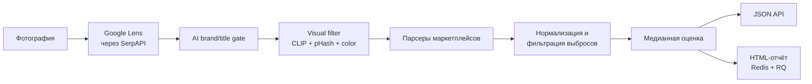

<p align="center">
  <strong>Русский</strong> · <a href="./README_EN.md">English</a>
</p>

<h1 align="center">Bag Price Analyzer API</h1>

<p align="center">
  API для оценки рыночной стоимости люксовых сумок по фотографии
</p>

<p align="center">
  
  
  
  
</p>

> [!NOTE]
> Это очищенная portfolio-версия действующего проекта. В репозитории нет production-ключей, прокси, пользовательских изображений, логов, результатов анализа и конфигурации серверов. Для выполнения реального анализа нужны собственные ключи внешних API.

## О проекте

Сервис получает фотографию товара, ищет визуально похожие объявления, отбирает релевантные карточки и рассчитывает устойчивую рыночную оценку. Результат доступен как JSON, а подробный HTML-отчёт может формироваться в фоновой очереди.

Основные возможности:

- поиск похожих товаров через Google Lens и SerpAPI;
- AI-фильтрация по бренду, модели и смысловой близости;
- опциональная визуальная проверка через OpenCLIP, perceptual hash и цветовые признаки;
- доменные парсеры для eBay, Vestiaire Collective, The RealReal, Rebag и других площадок;
- нормализация валют, состояний товара и статусов продажи;
- отдельные медианы для доступных и проданных товаров;
- фильтрация выбросов и объяснимые причины исключения позиций;
- фоновая генерация HTML-отчёта через Redis и RQ;
- структурированные логи с маскированием чувствительных значений.

## Как устроен pipeline



Подробное описание компонентов — в [архитектурной документации](docs/ARCHITECTURE.md).

## Быстрый запуск

Нужен Python 3.12. Для базового режима CLIP, Redis и браузеры Playwright не требуются.

```bash
git clone https://github.com/etozhegazonokosilka/bag-price-analyzer.git
cd bag-price-analyzer

python -m venv .venv
source .venv/bin/activate
python -m pip install --upgrade pip
python -m pip install -r requirements-312.txt

cp .env.example .env
```

На Windows вместо двух последних команд активации и копирования:

```powershell
.\.venv\Scripts\Activate.ps1
Copy-Item .env.example .env
```

Добавьте в `.env` как минимум:

```dotenv
SERPAPI_KEY=your_serpapi_key
OPENAI_API_KEY=your_openai_api_key
```

Запустите API:

```bash
python main.py
```

Проверка состояния:

```bash
curl http://127.0.0.1:5002/health
```

## Пример запроса

```bash
curl -X POST "http://127.0.0.1:5002/analyze" \
  -F "image=@example.jpg" \
  -F "avito_price=10500 RUB"
```

Сокращённый ответ:

```json
{
  "status": "ok",
  "ai_target_name": "Louis Vuitton Neverfull MM",
  "median_price_usd": 2536.85,
  "median_price_available_usd": 2536.85,
  "median_price_sold_usd": null,
  "items": [],
  "filtered_items": [],
  "report_status": "disabled"
}
```

## API

| Метод | Endpoint | Назначение |
|---|---|---|
| `GET` | `/health` | Состояние API, ключевых интеграций и локальных директорий |
| `POST` | `/analyze` | Анализ изображения (`multipart/form-data`, поле `image`) |
| `GET` | `/report-status/<task_id>` | Статус фоновой генерации отчёта |
| `GET` | `/results/<filename>` | Получение готового HTML-отчёта |

Необязательные поля `/analyze`:

- `avito_price` — цена вместе с валютой, например `10500 RUB`;
- `avito_currency` — валюта отдельным полем, например `RUB`.

## Конфигурация

Секреты и настройки конкретного окружения хранятся в `.env`. Безопасные параметры pipeline находятся в `.env.defaults`; значения из `.env` имеют приоритет.

| Переменная | Требуется | Назначение |
|---|---:|---|
| `SERPAPI_KEY` | да | Поиск через Google Lens |
| `OPENAI_API_KEY` | да* | AI-фильтрация заголовков и брендов |
| `EXCHANGE_RATE_API_KEY` | нет | Приоритетный провайдер валютных курсов |
| `EBAY_API_KEY`, `EBAY_API_SECRET` | нет | Официальный eBay API |
| `ZENROWS_API_KEY` | нет | Fallback для защищённых страниц |
| `IMGBB_API_KEY` | нет | Временная публикация изображения |
| `R2_*` | нет | Временное объектное хранилище Cloudflare R2 |
| `ROTATING_PROXY_URLS` | нет | Rotating proxy pool |
| `REPORT_QUEUE_ENABLED` | нет | Фоновая генерация отчётов |
| `VISUAL_SIMILARITY_ENABLED` | нет | Визуальная фильтрация через OpenCLIP |

\* Можно отключить через `LOCAL_TITLE_AI_ENABLED=0`, но качество отбора снизится.

### Визуальная фильтрация

Включите режим и установите ML-зависимости:

```bash
python -m pip install -r requirements-ml.txt
```

```dotenv
VISUAL_SIMILARITY_ENABLED=1
```

### Фоновая генерация отчётов

Запустите Redis, затем задайте:

```dotenv
REPORT_QUEUE_ENABLED=1
REPORT_QUEUE_REDIS_URL=redis://127.0.0.1:6379/0
REPORT_QUEUE_NAME=reports
```

В отдельном процессе:

```bash
python worker_report.py
```

## Структура

```text
.
├── api/                 # Flask routes и orchestration pipeline
├── scrapers/            # Парсеры отдельных маркетплейсов
├── services/            # SerpAPI, AI, CLIP, валюты, кэш и очередь
├── utils/               # Изображения, цены, proxy, transport и отчёты
├── config.py            # Конфигурация из environment variables
├── main.py              # Точка входа API
├── worker_report.py     # RQ worker для отчётов
└── .env.defaults        # Безопасные настройки по умолчанию
```

## Безопасность публичной версии

- `.env`, ключи, proxy-файлы, логи, загрузки и результаты исключены через `.gitignore`;
- в шаблоне `.env.example` нет рабочих credentials;
- production-конфигурация и service-файлы не включены;
- чувствительные значения маскируются перед записью в лог;
- CI проверяет синтаксис, PEP-8 и правила оформления документации без обращения к внешним сервисам.

Перед каждым публичным push рекомендуется дополнительно запускать secret scanner (`gitleaks`, `trufflehog` или GitHub Secret Scanning).

## Стиль кода

Локальная проверка запускается без дополнительных зависимостей:

```bash
python scripts/check_style.py
```

Проверка контролирует PEP-8-совместимые отступы и интервалы, длину строк, хвостовые пробелы, bare `except`, синтаксис и оформление документации. Комментарии и docstrings пишутся на русском языке, начинаются со строчной буквы и не заканчиваются точкой.

## Тесты

Тесты не обращаются к реальным API и не требуют рабочих ключей:

```bash
python -m unittest discover -s tests -v
```

Набор проверяет HTTP-контракт, фильтрацию товарных ссылок, форматы цен и валют, JSON-LD, маскирование proxy credentials, защиту URL и экранирование HTML-отчёта. Те же тесты автоматически запускаются в GitHub Actions при каждом push и pull request.

## Ограничения демо

- результат зависит от доступности и тарифов внешних API;
- сайты могут менять HTML и anti-bot-механизмы;
- в репозитории нет тестовых пользовательских фотографий из соображений приватности;
- полный production deployment и Telegram-интеграция намеренно не публикуются.

## Лицензия

Исходный код опубликован только для ознакомления. Использование, копирование, модификация и распространение без письменного разрешения правообладателя запрещены — см. [LICENSE](LICENSE).

---

Автор: [@etozhegazonokosilka](https://github.com/etozhegazonokosilka)
