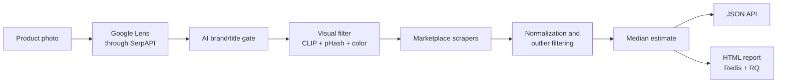

<p align="center">
  <a href="./README.md">Русский</a> · <strong>English</strong>
</p>

<h1 align="center">Bag Price Analyzer API</h1>

<p align="center">
  An API for estimating the market value of luxury handbags from a photo
</p>

<p align="center">
  
  
  
  
</p>

> [!NOTE]
> This is a sanitized portfolio version of a production project. It does not contain production credentials, proxy pools, user images, logs, analysis results, server configuration, or deployment files. Running a real analysis requires your own third-party API keys.

## Overview

The service receives a product photo, finds visually similar listings, filters the candidates, and calculates a robust market estimate. The result is returned as JSON, while an optional background queue can build a detailed HTML report.

Key capabilities:

- visual product discovery through Google Lens and SerpAPI;
- AI filtering by brand, model, and semantic relevance;
- optional OpenCLIP, perceptual hash, and color-based visual checks;
- marketplace-specific scrapers for eBay, Vestiaire Collective, The RealReal, Rebag, and other platforms;
- normalization of currencies, item conditions, and availability statuses;
- separate median estimates for available and sold items;
- outlier handling with explainable rejection reasons;
- background HTML report generation with Redis and RQ;
- structured logging with sensitive-value masking.

## Pipeline



See the [architecture document](docs/ARCHITECTURE.md) for a detailed component breakdown.

## Quick start

Python 3.12 is required. The basic mode does not require CLIP, Redis, or Playwright browsers.

```bash
git clone https://github.com/etozhegazonokosilka/bag-price-analyzer.git
cd bag-price-analyzer

python -m venv .venv
source .venv/bin/activate
python -m pip install --upgrade pip
python -m pip install -r requirements-312.txt

cp .env.example .env
```

On Windows, use:

```powershell
.\.venv\Scripts\Activate.ps1
Copy-Item .env.example .env
```

Add at least the following values to `.env`:

```dotenv
SERPAPI_KEY=your_serpapi_key
OPENAI_API_KEY=your_openai_api_key
```

Start the API:

```bash
python main.py
```

Check its status:

```bash
curl http://127.0.0.1:5002/health
```

## Request example

```bash
curl -X POST "http://127.0.0.1:5002/analyze" \
  -F "image=@example.jpg" \
  -F "avito_price=10500 RUB"
```

Shortened response:

```json
{
  "status": "ok",
  "ai_target_name": "Louis Vuitton Neverfull MM",
  "median_price_usd": 2536.85,
  "median_price_available_usd": 2536.85,
  "median_price_sold_usd": null,
  "items": [],
  "filtered_items": [],
  "report_status": "disabled"
}
```

## API

| Method | Endpoint | Purpose |
|---|---|---|
| `GET` | `/health` | Reports API, integration, and local-directory status |
| `POST` | `/analyze` | Analyzes an image supplied as the `image` multipart field |
| `GET` | `/report-status/<task_id>` | Returns background report generation status |
| `GET` | `/results/<filename>` | Serves a generated HTML report |

Optional `/analyze` fields:

- `avito_price` — a price with an optional currency, such as `10500 RUB`;
- `avito_currency` — a separate currency value, such as `RUB`.

## Configuration

Secrets and environment-specific settings belong in `.env`. Safe pipeline defaults live in `.env.defaults`; values from `.env` take priority.

| Variable | Required | Purpose |
|---|---:|---|
| `SERPAPI_KEY` | yes | Google Lens search |
| `OPENAI_API_KEY` | yes* | AI title and brand filtering |
| `EXCHANGE_RATE_API_KEY` | no | Preferred currency-rate provider |
| `EBAY_API_KEY`, `EBAY_API_SECRET` | no | Official eBay API |
| `ZENROWS_API_KEY` | no | Protected-page fallback |
| `IMGBB_API_KEY` | no | Temporary public image upload |
| `R2_*` | no | Temporary Cloudflare R2 object storage |
| `ROTATING_PROXY_URLS` | no | Rotating proxy pool |
| `REPORT_QUEUE_ENABLED` | no | Background report generation |
| `VISUAL_SIMILARITY_ENABLED` | no | OpenCLIP visual filtering |

\* AI filtering can be disabled with `LOCAL_TITLE_AI_ENABLED=0`, but relevance may decrease.

### Visual filtering

Install the optional ML dependencies:

```bash
python -m pip install -r requirements-ml.txt
```

Enable the feature:

```dotenv
VISUAL_SIMILARITY_ENABLED=1
```

### Background reports

Start Redis and configure:

```dotenv
REPORT_QUEUE_ENABLED=1
REPORT_QUEUE_REDIS_URL=redis://127.0.0.1:6379/0
REPORT_QUEUE_NAME=reports
```

Run the report worker in a separate process:

```bash
python worker_report.py
```

## Project structure

```text
.
├── api/                 # Flask routes and pipeline orchestration
├── scrapers/            # Marketplace-specific parsers
├── services/            # SerpAPI, AI, CLIP, currency, cache, and queue
├── utils/               # Images, prices, proxies, transport, and reports
├── config.py            # Environment-based configuration
├── main.py              # API entry point
├── worker_report.py     # RQ report worker
└── .env.defaults        # Safe default settings
```

## Code style

Run the repository's dependency-free quality check:

```bash
python scripts/check_style.py
```

It validates PEP-8-compatible indentation and spacing, line lengths, trailing whitespace, bare `except` clauses, Python syntax, and documentation conventions. Source comments and docstrings are written in Russian, begin with lowercase letters, and do not end with periods.

## Tests

The test suite does not call live APIs and does not require working credentials:

```bash
python -m unittest discover -s tests -v
```

It covers the HTTP contract, product URL classification, price and currency formats, JSON-LD extraction, proxy credential masking, URL safety, and HTML report escaping. GitHub Actions runs the same suite on every push and pull request.

## Public-version security

- `.env`, credentials, proxy files, logs, uploads, and results are excluded by `.gitignore`;
- `.env.example` contains no working credentials;
- production service and deployment files are omitted;
- sensitive values are masked before logging;
- CI checks syntax, PEP-8 rules, and documentation style without contacting external services.

Running a dedicated secret scanner such as Gitleaks, TruffleHog, or GitHub Secret Scanning before each public push is still recommended.

## Demo limitations

- results depend on third-party API availability and pricing;
- marketplace HTML and anti-bot mechanisms can change;
- user test images are omitted for privacy reasons;
- the complete production deployment and Telegram integration are intentionally private.

## License

The source code is published for viewing only. Usage, copying, modification, and redistribution require prior written permission from the copyright holder. See [LICENSE](LICENSE).

---

Author: [@etozhegazonokosilka](https://github.com/etozhegazonokosilka)
